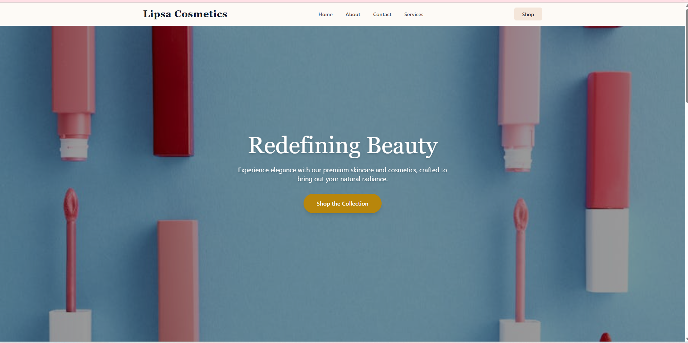
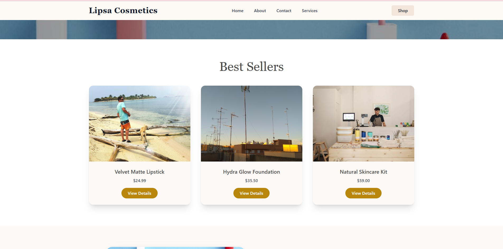
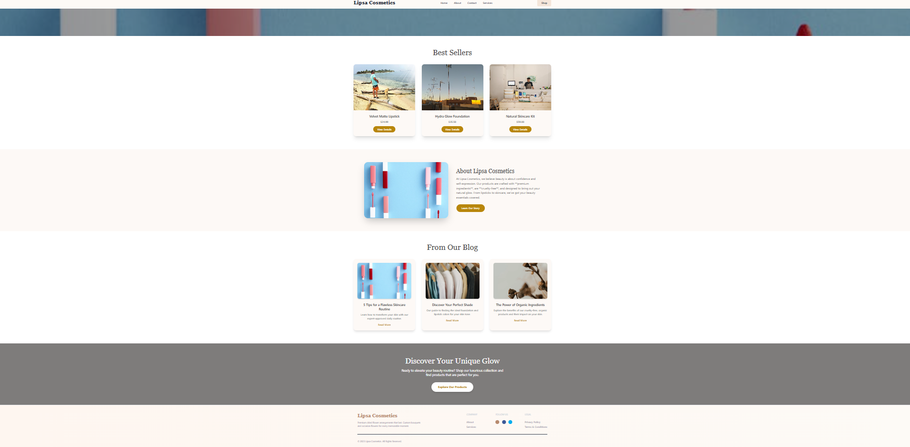
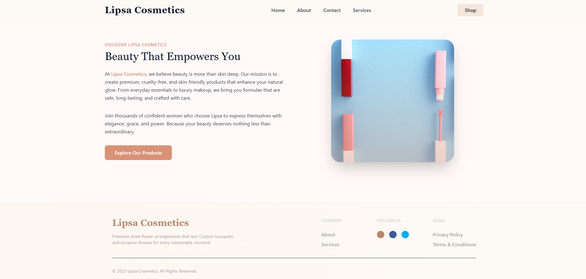
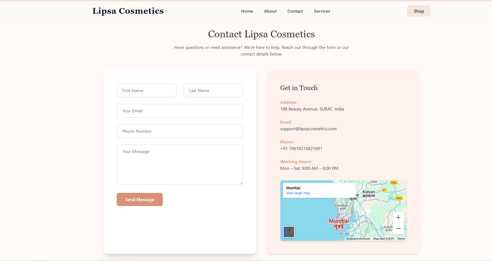
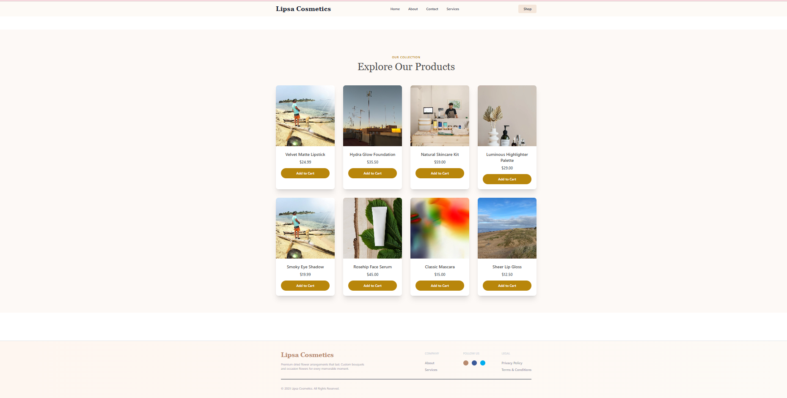

💄 Lipsa Cosmetic App

A modern React JS application for managing cosmetic product lists and daily beauty routines.
This app allows users to add cosmetic items with details like Product Name, Brand, Category, Price, Quantity, and Usage Notes.
All added products are displayed in a stylish, responsive table.

🚀 Features

📝 Cosmetic Product Form – Add new beauty products or routines

✅ Input validation (HTML5 form validations)

🎨 Category selection (dropdown: Skincare, Makeup, Haircare, etc.)

💰 Price & Quantity inputs

🖊️ Usage notes – Add personal tips or reminders

📊 Registered products displayed in a formatted table

💻 Clean and responsive UI

📂 Project Structure
lipsa-cosmetic-app/
│-- public/
│   └── output.png        # Project screenshot
│-- src/
│   ├── components/        # Form & Table components
│   ├── App.js
│   └── index.js
│-- package.json
│-- README.md

🛠️ Installation and Setup

Clone the repository

git clone https://github.com/Raj6873/React-js.git

Navigate into the project

cd lipsa-cosmetic-app

Install dependencies

npm install

Start the development server

npm start

Open in browser

http://localhost:5173

📸 Output

    
Here’s how your Lipsa Cosmetic App will look:

Cosmetic Product Form & Product List Table with clean, responsive UI

📦 Tech Stack

⚛️ React JS

🖌️ CSS3

🌐 HTML5

🤝 Contributing

Contributions are welcome!
To improve this project:

Fork the repo

Create a feature branch (feature-new)

Commit your changes

Submit a Pull Request

📜 License

This project is licensed under the MIT License.

✨ Made with ❤️ by Lipsa Cosmetic using React