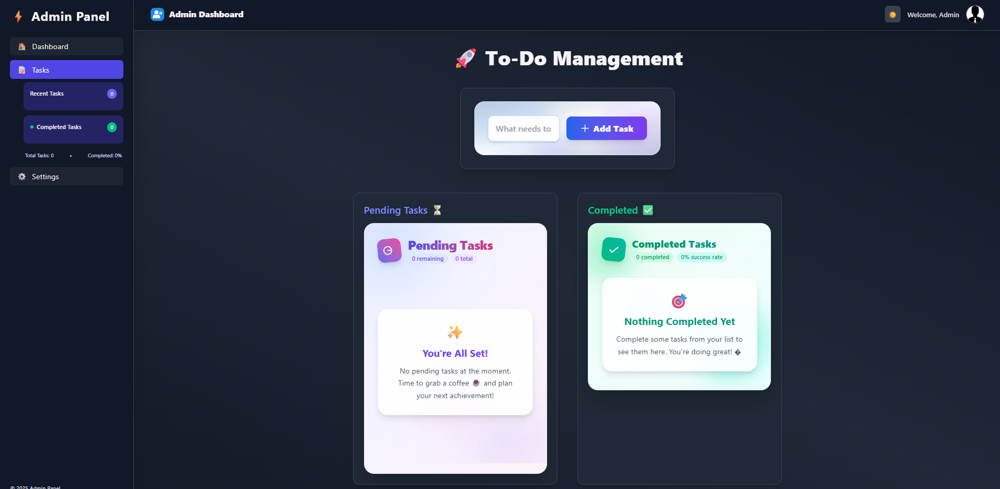

To-Do App
A simple yet powerful React JS application for managing your daily tasks. This app helps you stay organized by allowing you to add, edit, mark as complete, and delete to-do items.

🚀 Features
📝 Add new tasks to your list

✅ Mark tasks as completed with a simple click

🗑️ Delete tasks you no longer need

🎨 Edit existing tasks to update their content

💻 Clean, minimalistic, and responsive UI

📂 Project Structure
to-do-app/
│-- public/
│   └── index.html         # Main HTML file
│-- src/
│   ├── components/        # Components for Form, ToDoList, and individual items
│   ├── App.js             # Main application component
│   └── index.js           # Entry point
│-- package.json
│-- README.md
🛠️ Installation and Setup
Clone the repository

Bash

git clone https://github.com/Raj6873/React-js.git
Navigate into the project directory

Bash

cd to-do-app
Install dependencies

Bash

npm install
Start the development server

Bash

npm start
Open in browser

http://localhost:3000
📦 Tech Stack
⚛️ React JS

🖌️ CSS3

🌐 HTML5

📸 Output

🤝 Contributing
Contributions are what make the open-source community an amazing place to learn, inspire, and create. Any contributions you make are greatly appreciated.

Fork the Project

Create your Feature Branch (git checkout -b feature/new-feature)

Commit your Changes (git commit -m 'Add some new-feature')

Push to the Branch (git push origin feature/new-feature)

Open a Pull Request

📜 License
This project is licensed under the MIT License.

✨ Made with ❤️ using React